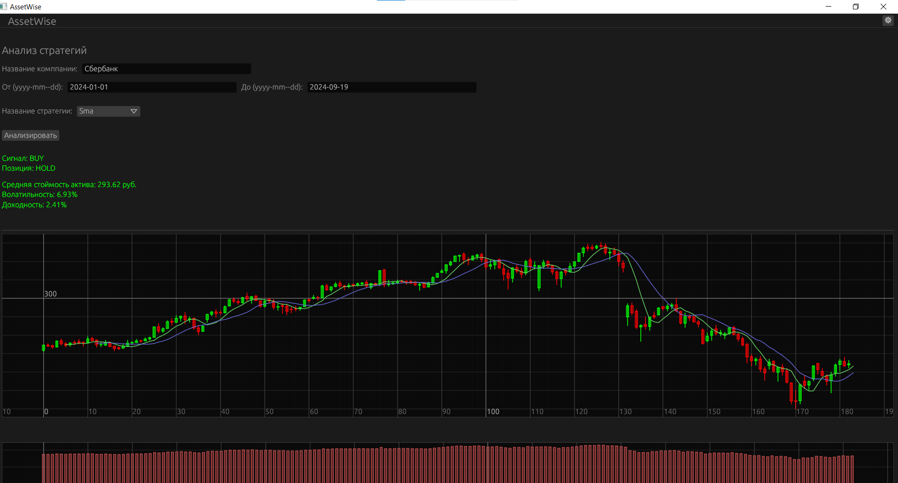
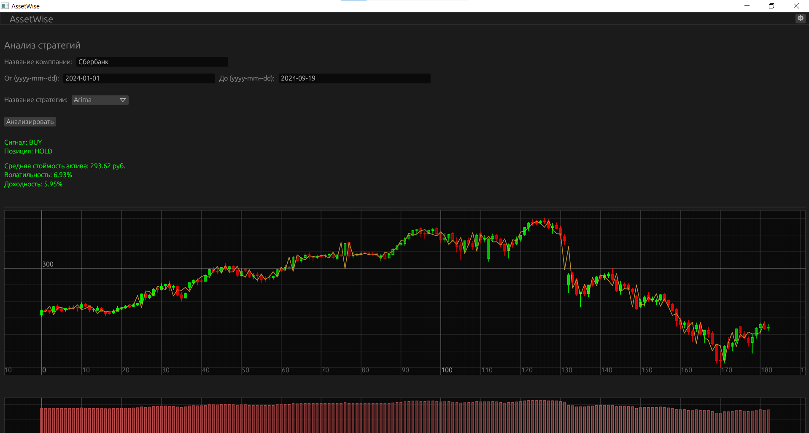

# AssetWise for Algorithmic Trading


Welcome to AssetWise, a GUI-based desktop application written in Rust! This program is designed to test stock exchange strategies using methods such as SMA5, SMA12, ARIMA, and Kalman Filter.

## Features

- **ARIMA Strategy:** Implements the ARIMA (AutoRegressive Integrated Moving Average) model for time-series prediction.
- **SMA5 / SMA12 Strategies:** Uses Simple Moving Averages (SMA) with two different periods (5 and 12) for trend analysis.
- **Kalman Filter:** Applies the Kalman Filter for smoother trend estimation.
- **Company Name Input:** Analyze company stocks by entering their name, not just their ticker symbol.
- **Customizable Settings:** Choose between different themes and graph types (standard and candlestick charts).
- **Graphical User Interface (GUI):** AssetWise provides an intuitive and easy-to-use GUI for testing strategies.

## Application Preview

Here are some screenshots of the application in action:




## About

AssetWise is developed by a master's degree student for research purposes in algorithmic trading. It explores the effectiveness of ARIMA, SMA, and Kalman Filter strategies in automated trading systems.

## Installation

To build and run AssetWise, ensure you have Rust installed on your system. Then, clone this repository and use Cargo to build the project.

```bash
git clone https://github.com/ronik-v/assetwise.git
cd assetwise
cargo build --release
```

## Usage
After building the project, you can run the Trade Robot from the command line:
```bash
cargo run
```

## License
This project is licensed under the MIT License. See the [LICENSE](LICENSE) file for details.